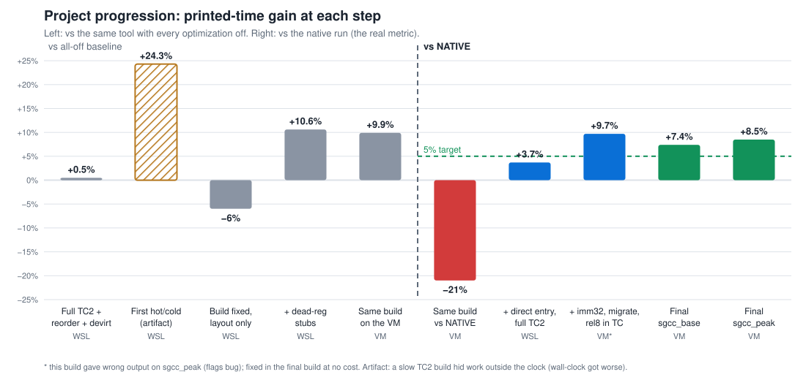
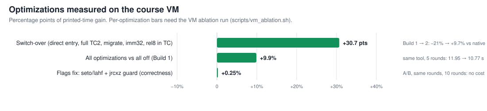

# Binary Optimization

My work for Technion's course 046275, *Dynamic Binary Translation and Optimization* (ex3, ex4
and the project were done in pairs). Every tool here is a
[Pin](https://www.intel.com/content/www/us/en/developer/articles/tool/pin-a-dynamic-binary-instrumentation-tool.html)
tool, written in C++ against Pin 4.0 and tested on the course's Linux VM.

The repo holds exactly what was handed in for each assignment: the source, the makefiles, the
submitted README and the built `.so`.

## The exercises

- **ex1** counts how often each routine runs and how many instructions it executes, and samples
  register values. A warm-up in Pin's JIT mode.
- **ex2** goes one level down: it counts every basic block and branch edge, and records where
  indirect jumps actually go. The output is `edge-profile.csv`.
- **ex3** is a debugging job. The course's probe-mode translator (`btranslate.cpp`) crashed on
  `cpugcc_r_base`; we narrowed it down to the routines it translated wrong and fixed it.
- **ex4** makes the course's profiler (`bprofile.cpp`) run on every binary and much cheaper,
  mainly by not saving registers that are dead anyway.

Each folder looks the same: `README.txt`, the `.so`, `makefile`, `makefile.rules`, and the
source under `src/`.

## The final project

The project ties it all together. `project.so` copies the program into a translation cache
(TC) and profiles it for two seconds. Then a background thread builds an optimized second
cache (TC2) from that profile and moves the running program into it. The goal was to beat
the native program, run without Pin, by more than 5%, with the slow profiling time counted.

We got there on the gcc binaries:

| Binary | Gain vs native (median of 9 runs) |
|---|---|
| sgcc_peak | **+8.5%** (above 5% in all 9 runs) |
| sgcc_base | **+7.4%** |
| cc1 | -1.5% |
| bzip2 | -3.7% (a 5.6 s run is too short to win back 2 s of profiling) |

The output matched native in every run.



The first build already beat the same tool with everything switched off by 9.9%, but it was still
21% slower than the native program. Since the 2 seconds of slow, profiled TC are charged in
full, TC2 alone could not make that back. The step that crossed native was removing detours:
every call used to pass through Pin's bridge and the TC head before reaching TC2, and frames
already running in TC stayed there. Pointing the original entries straight into TC2, building
TC2 for the whole image and moving running frames over took the second build from -21% to
+9.7%.



One bug is worth telling: sgcc_peak gave wrong output while everything else passed. Its switch
statements read CPU flags across the indirect jump, and our code changed them right there. We
now keep the flags with `seto`/`lahf` and use a guard that doesn't touch them (`lea` +
`jrcxz`). Measured side by side, the fix costs nothing.

- `final_project/src/`: the tool and its README (compile and run commands, thresholds, all knobs).
- `final_project/report/`: final screenshots, the graphs, and the data behind them.
- `final_project/results/`: the log of every VM run.

## Building

From any exercise folder, or from `final_project/src/`:

```bash
make obj-intel64/<tool>.so PIN_ROOT=/path/to/pin-external-4.0-...-gcc-linux
```

Each `README.txt` has the exact run command.
